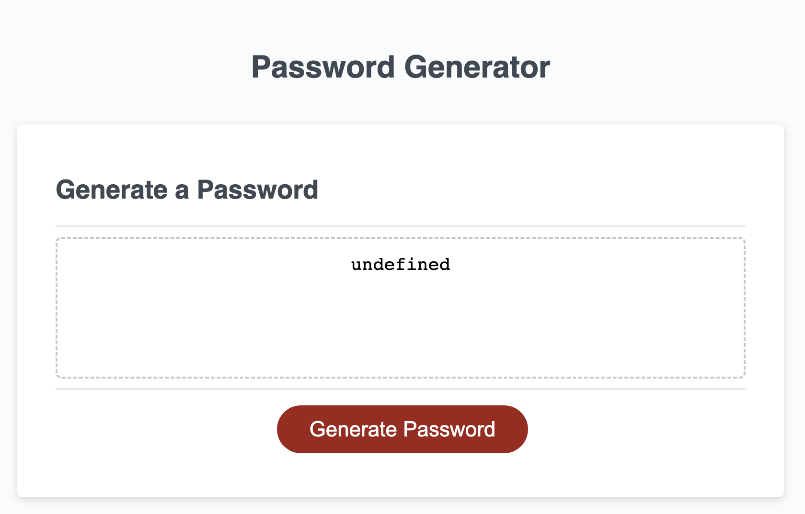
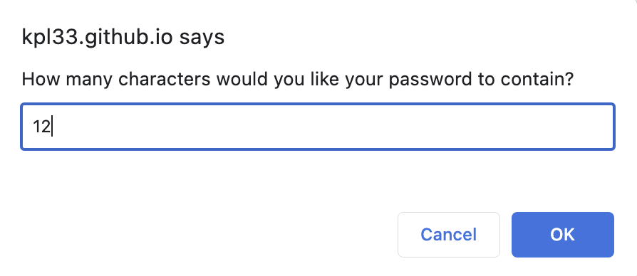
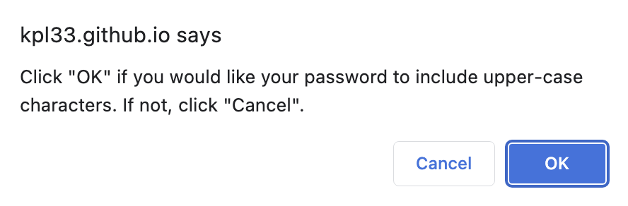
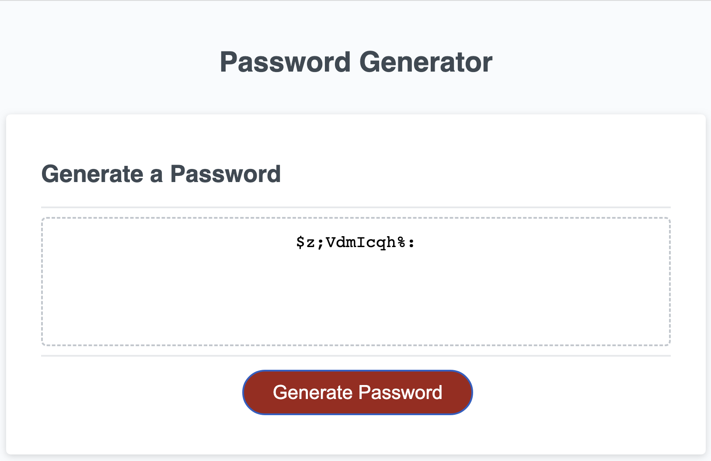

# **_Random Password Generator_**

 

## Overview

Tired of thinking of long, complex passwords? Use this simple app to randomly-generate a password for you!
 

## Application Instructions

1. Visit https://kpl33.github.io/pwd_gen/ to use this app. 
2. Click the "Generate Password" button. 
3. Follow the on-screen prompts to establish a password length. 
4. Follow more prompts to choose preferences on what types of characters you'd like your password to include. 

## Static Screen-Captures of the Application

##

##

##

##

 

## Contributors To This Application

Kevin Lewis

 

# **_Thank you for using this App!_**

## Questions? Contact the Developer @...

https://github.com/KPL33 on GitHub 
or via Email: kevinsname2003@yahoo.com
